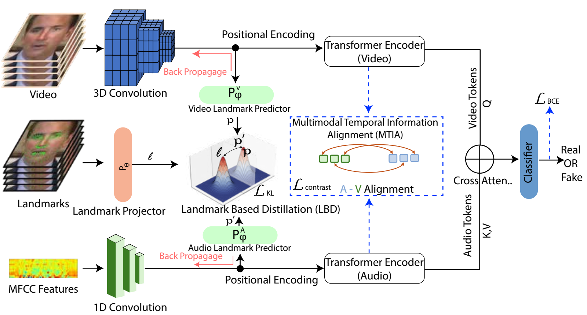

<h1 align="center">Beyond Masking: Landmark-based Representation Learning and Knowledge-Distillation for Audio-Visual Deepfake Detection</h1>

<p align="center">
  Chan Park<sup>1</sup>, Muhammad Shahid Muneer<sup>2</sup>, Simon S. Woo<sup>2,*</sup>
  <br>
  <sup>1</sup>Department of Artificial Intelligence, Sungkyunkwan University · <sup>2</sup>Department of Computer Science &amp; Engineering, Sungkyunkwan University
  <br>
  DASH Lab · <sup>*</sup> Corresponding author
</p>

<p align="center">
  <a href="https://cikm2025.org/">CIKM 2025</a> · 34th ACM International Conference on Information and Knowledge Management (Short Paper)
</p>

<p align="center">
  <a href="https://ckck12.github.io/Beyond-Masking/"></a>
  <a href="paper.pdf"></a>
  <a href="https://doi.org/10.1145/3746252.3760853"></a>
  <a href="https://github.com/Ckck12/Beyond-Masking"></a>
</p>

<p align="center">
  
</p>

## View the project page

**[Open the project page](https://ckck12.github.io/Beyond-Masking/)**: the method, the intra- and cross-dataset result tables (Tables 1–2), the ablation (Table 3), and the Grad-CAM comparison.

Official PyTorch implementation of the CIKM 2025 short paper. The framework uses video, audio, and facial landmarks:

1. **Landmark-based Distillation (LBD)** aligns facial-landmark predictions from the video and audio encoders with a projected landmark representation through KL-divergence, so that the encoders focus on facial geometry rather than spurious background information.
2. **Multimodal Temporal Information Alignment (MTIA)** uses transformer encoders, cross-attention, and contrastive learning to enforce temporal consistency between the audio and visual representations.

## Contents

- TL;DR and abstract
- Real-world audio-visual deepfakes collected from social media (Figure 1)
- Method overview: LBD and MTIA (Figure 2)
- Intra-dataset results on DF-TIMIT (LQ/HQ), DFDC, FakeAVCeleb, and KoDF (Table 1)
- Cross-dataset results on DFDC and the Real-World (RW) dataset (Table 2)
- Ablation study (Table 3) and Grad-CAM analysis (Figure 3)
- BibTeX

## Results at a glance

Our model (ACC / AUC, %), as reported in the paper. See the project page for all baselines.

Intra-dataset (Table 1):

| Params | DF-TIMIT (LQ) ACC | DF-TIMIT (LQ) AUC | DF-TIMIT (HQ) ACC | DF-TIMIT (HQ) AUC | DFDC ACC | DFDC AUC | FakeAVCeleb ACC | FakeAVCeleb AUC | KoDF ACC | KoDF AUC |
|---:|---:|---:|---:|---:|---:|---:|---:|---:|---:|---:|
| 32.4 M | 96.82 | 97.35 | 98.98 | 97.72 | 89.75 | 90.07 | 92.38 | 93.25 | 93.48 | 94.75 |

Cross-dataset, trained on FakeAVCeleb and KoDF (Table 2):

| Params | DFDC ACC | DFDC AUC | RW Dataset ACC | RW Dataset AUC |
|---:|---:|---:|---:|---:|
| 32.4 M | 78.12 | 78.82 | 75.12 | 75.65 |

## Code / Usage

### Setup

#### 1. Clone the repository

```bash
git clone https://github.com/Ckck12/Beyond-Masking.git
cd Beyond-Masking
```

Environment:

- Python 3.9
- PyTorch 2.6 + cu124
- CUDA version 12.4

### Dataset Preparation

This project supports multiple public deepfake datasets. The corresponding data loaders can be found in the `loaders/` directory.

#### 1. Download Datasets

Download the original datasets (e.g., FakeAVCeleb, KoDF, FaceForensics++) and place them in a designated directory (e.g., `/media/NAS/DATASET/`).

> **Note:** All the datasets have different file structures, so you have to rearrange the code or the folder structure to fit your structure.

#### 2. Run Preprocessing

Before training, you must preprocess each dataset to extract cropped face videos, audio waveforms (`.wav`), and facial landmarks (`.npy`).

1. Prepare video data → 2. Prepare landmark data (MediaPipe) → 3. Prepare audio data.

#### 3. Directory Structure for Preprocessed Data (Example)

```bash
/media/NAS/DATASET/FakeAVCeleb_v1.2/
├── FakeAVCeleb_metadata.csv
└── landmark_features/
    └── features_mediapipe/
        ├── FakeVideo-FakeAudio/
        │   └── African/
        │       └── men/
        │           └── id00076/
        │               └── 00109_2_id00701_wavtolip/
        │                   ├── cropped_video.mp4      # Cropped face video
        │                   ├── cropped_video.wav      # Extracted audio
        │                   └── landmarks.npy          # Landmark data
        └── RealVideo-RealAudio/
            └── African/
                └── men/
                    └── id00076/
                        └── 00109/
                            ├── cropped_video.mp4
                            ├── cropped_video.wav
                            └── landmarks.npy
```

Preparing all the modality data in advance is much more efficient.

### Training

Training scripts for each dataset are provided as `run_*.sh` files in the root directory. These scripts are pre-configured with the optimized hyperparameters reported in our paper.

To start training on the FakeAVCeleb dataset, for example, simply run the corresponding script:

```bash
bash run_fakeavceleb.sh
```

You can easily customize the training by modifying the variables (e.g., `BATCH_SIZE`, `LEARNING_RATE`, `FEATURE_DIM`) at the top of each script. The training progress, logs, and best model checkpoints will be saved to the `saved_models/` directory.

## Citation

If you find this work useful, please cite:

```bibtex
@inproceedings{park2025beyondmasking,
  title     = {Beyond Masking: Landmark-based Representation Learning and
               Knowledge-Distillation for Audio-Visual Deepfake Detection},
  author    = {Park, Chan and Muneer, Muhammad Shahid and Woo, Simon S.},
  booktitle = {Proceedings of the 34th ACM International Conference on
               Information and Knowledge Management (CIKM '25)},
  year      = {2025},
  publisher = {Association for Computing Machinery},
  address   = {New York, NY, USA},
  location  = {Seoul, Republic of Korea},
  isbn      = {979-8-4007-2040-6},
  doi       = {10.1145/3746252.3760853}
}
```
